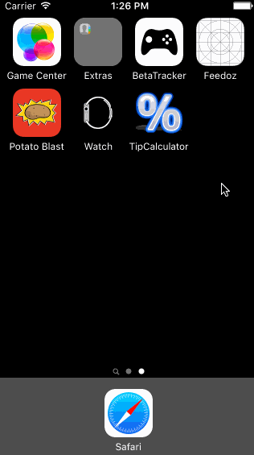

# TipCalculator

This is a Tip Calculator application for iOS submitted as the [pre-assignment](https://gist.github.com/timothy1ee/7747214) requirement for CodePath.

Time spent: 5 hours

Completed:

* [] Required: User can enter a bill amount, choose a tip percentage, and see the tip and total values.
* [] Required: Settings page to change the default tip percentage.
* [] Optional: Save bill amount
* [] Optional: Format output with currency separators

Notes:
This is designed to work on iPhone only and is only optimized for portrait view.

GIF created with [LiceCap](http://www.cockos.com/licecap/).
